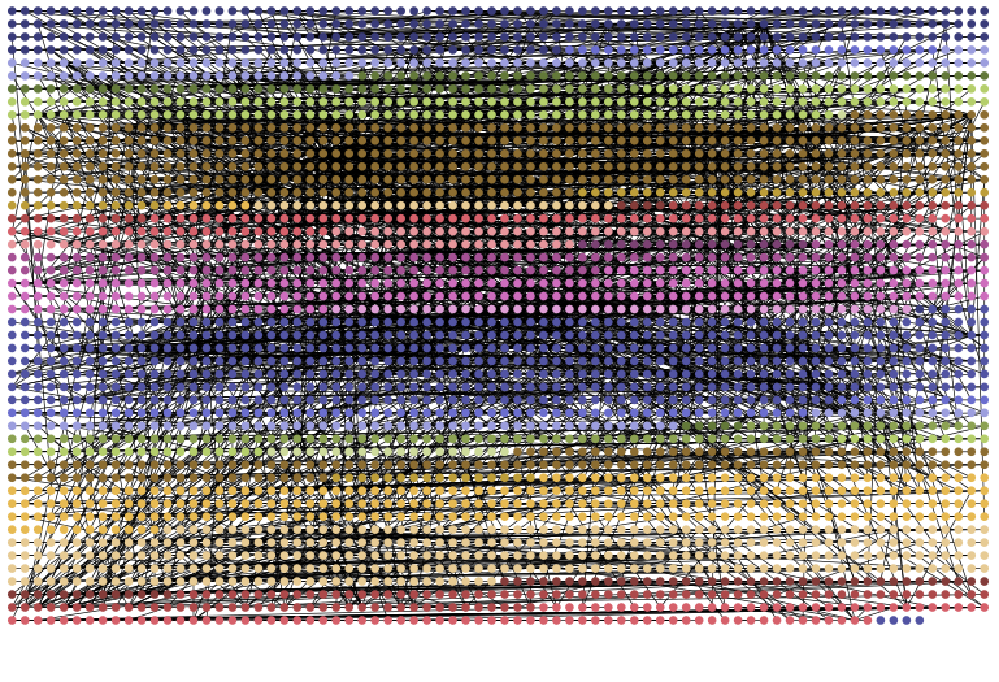
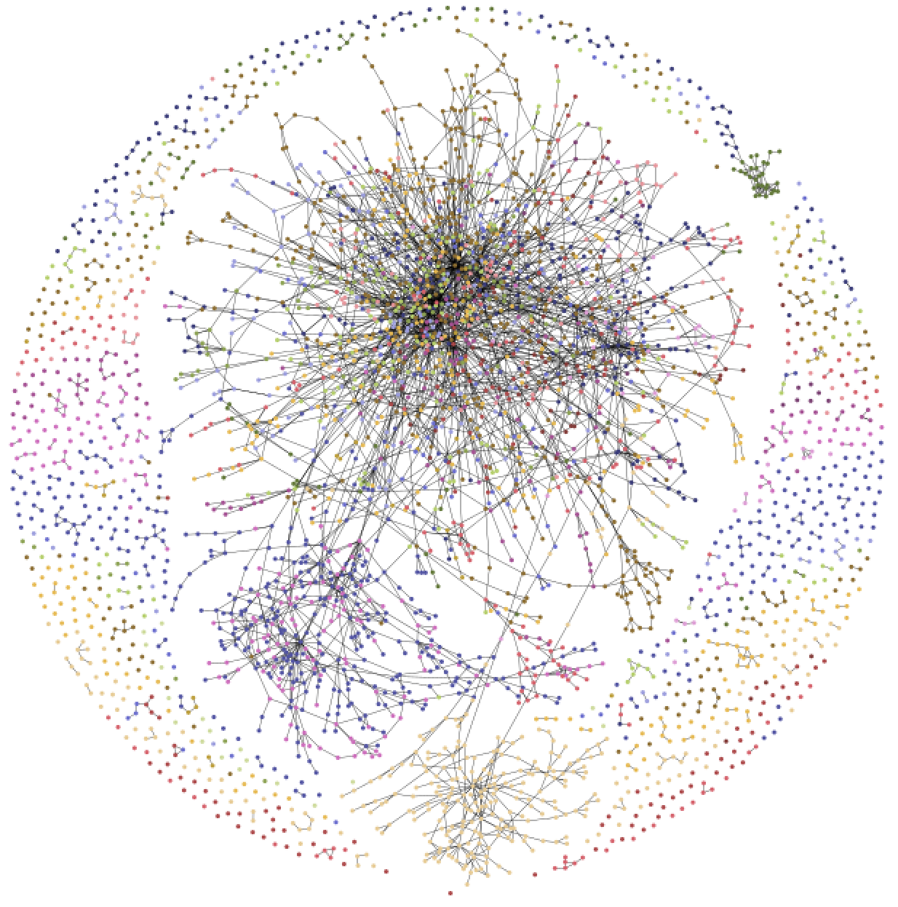
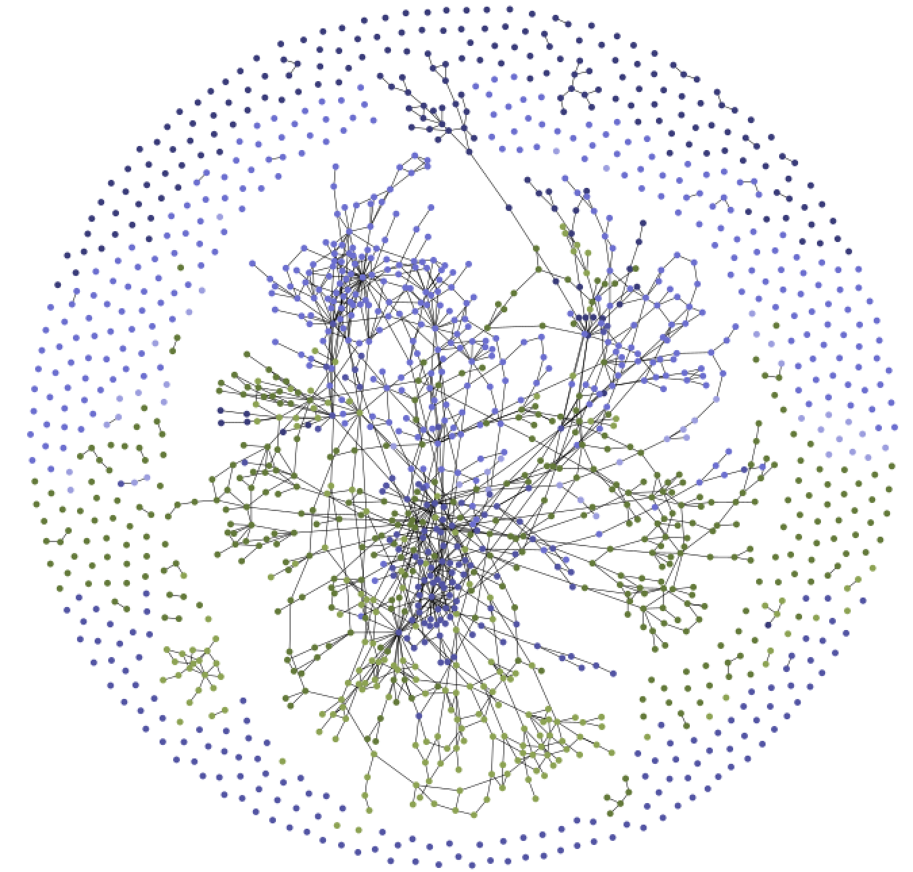

# GWBasicVisualization
Visualizing GW-Basic source code, written in assembly, using [Roassal3](https://github.com/ObjectProfile/Roassal3) and [Pharo](http://pharo.org).

The following pictures show the invocation between the routines from the repository http://github.com/dspinellis/GW-BASIC
Each dot is a routine, each file is associated to a color. The first picture uses a simple grid layout while the second picture uses a force-based layout. Both pictures show the same results. 

This was done as a simple programming exercise. If you have a wishlist, enter it in as an issue.

The source code of GWBasic is written in Assembly is made of over 34K LOC, spread in 35 files, totalling over 3.6K Assembly inter-connected routines. Here are some visualization that illustrates the routine interaction.

-----

On the very same tone, here is [MSDOS Version 1.25](https://github.com/microsoft/MS-DOS). MSDOS 1.25 is 13K LOC long made of 1,573 Assembly routines. Here are their connections:

